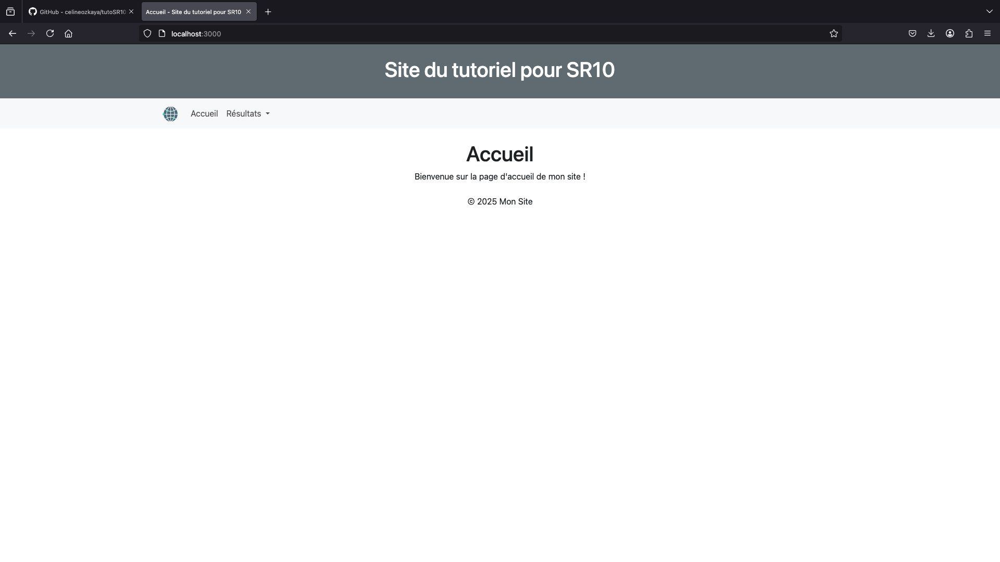
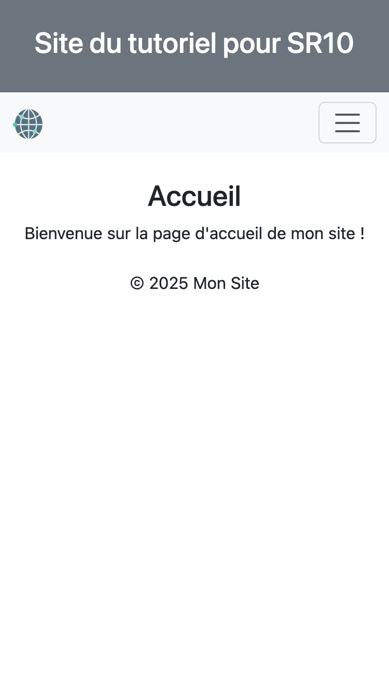
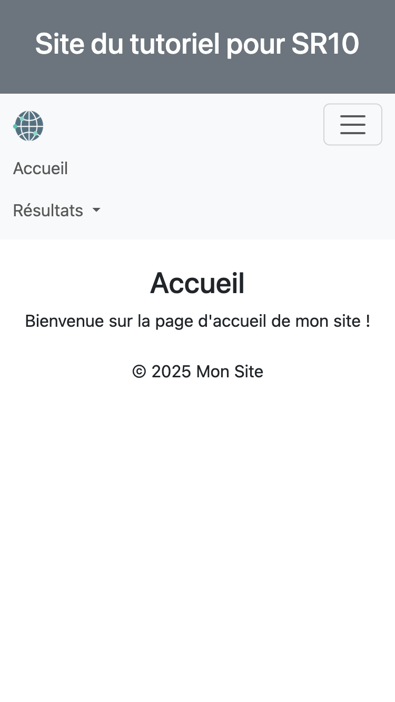
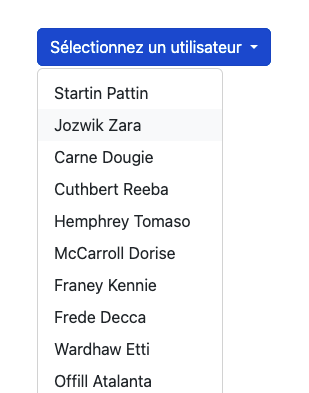
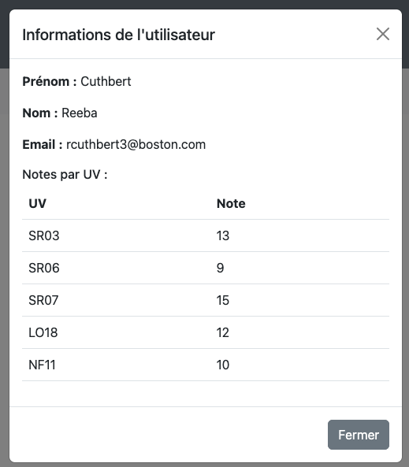

# Tutoriel application sans backend pour SR10
Techno : HTML, EJS, ExpressJS, NodeJS, Bootstrap

## Introduction
Ce tutoriel permet de créer une application affichant des informations sur des utilisateurs ainsi que leurs résultats académiques sous forme de tableaux et graphiques. Pour ce faire, nous utilisons les technologies suivantes : 
- [Node.js](https://nodejs.org/en/about) : Un environnement d’exécution JavaScript côté serveur, qui nous permet de créer des applications web sans avoir besoin d’un serveur comme Apache ou Nginx.

- [Express.js](https://expressjs.com/en/starter/installing.html) : Un framework minimaliste pour Node.js, qui facilite la création d’applications web et la gestion des routes et requêtes HTTP.

- [EJS (Embedded JavaScript)](https://ejs.co/#install) : EJS est un moteur de templates utilisé avec Node.js pour générer dynamiquement du HTML. Il permet d’insérer facilement des variables, des boucles ou des conditions JavaScript directement dans le code HTML, par exemple <%= variable %> pour afficher une valeur. EJS est utile lorsqu’on veut créer des pages web personnalisées en fonction des données : par exemple, afficher une liste d’utilisateurs récupérée depuis une base de données. On l’utilise souvent dans des applications web avec Express.js, pour séparer la logique du serveur et l’affichage.

- [Bootstrap](https://getbootstrap.com/docs/5.3/getting-started/introduction/) : Bootstrap est une bibliothèque gratuite et open source, qui permet de créer facilement des sites web modernes, responsives et bien structurés. Elle fournit un ensemble de styles prédéfinis (boutons, formulaires, menus, etc.) ainsi que des composants interactifs (comme des carrousels ou des fenêtres modales) prêts à l’emploi. Bootstrap s’adapte automatiquement à tous les types d’écrans (ordinateur, tablette, mobile) grâce à un système de grille flexible. On l’utilise donc principalement pour gagner du temps lors de la création d’interfaces web, sans avoir à tout coder en CSS ou JavaScript soi-même.

## Sommaire
- [Initialisation du projet](#initialisation-du-projet)
- [Mise en place du serveur](#mise-en-place-du-serveur)
- [Main](#main)
- [Page d'accueil](#page-daccueil)
- [Mise en place des composants réutilisables](#mise-en-place-des-composants-réutilisables)
    - [Navbar](#navbar)
    - [Header](#header)
    - [Footer](#footer)
- [Données](#données)
- [Résultats sous forme de tableaux](#résultats-sous-forme-de-tableaux)
    - [Route](#route)
    - [Page](#page)
    - [Gestion de la modale](#gestion-de-la-modale)
- [Résultats sous forme de graphiques](#résultats-sous-forme-de-graphiques)
    - [Route](#route-1)
    - [Page](#page-1)

## Initialisation du projet
Suivre les instructions : https://nodejs.org/fr/download

### Création du projet
```shell
mkdir mon_projet
cd mon_projet
npm init -y
npm install express ejs
```
A ce stade, les fichiers package.json et package-lock.json ainsi que le dossier node_modules sont crées. 

Le fichier package.json décrit les informations du projet et liste les dépendances (les bibliothèques que le projet utilise, par exemple, dans ce projet : express, ejs, chart.js) nécessaires. Le fichier package-lock.json enregistre les versions installées pour garantir une installation identique sur toutes les machines. Le dossier node_modules est un répertoire créé automatiquement par npm (le gestionnaire de paquets de Node.js) qui contient toutes les dépendances et bibliothèques dont votre projet a besoin pour fonctionner. Vous pouvez ignorer ces fichiers et dossier. Une bonne pratique est de placer node_module dans le .gitignore avant de pousser votre projet puisqu'il est lourd et généré automatiquement.

Pour lancer l'application : 
```shell
node server.js
```
Ou bien, pour ne pas avoir à relancer l'application à chaque modification :
```shell
npm install -g nodemon
npx nodemon server.js
```

### Architecture

Voici l'architecture finale du projet :
```
/mon_projet
│-- /public
│   │-- data/
│   │   |-- user.json
│   │-- js/
│   │   |-- graphes.js
│   │   |-- modalUser.js
│   │-- images/
│   │   |-- logo.jpg
│-- /views
│   │-- pages/
│   |   │-- graphs.ejs
│   |   │-- index.ejs
│   |   │-- tables.ejs
│   │-- partials/
│   │   |-- dropdownUsers.ejs
│   │   |-- header.ejs
│   │   |-- navbar.ejs
│   │   |-- footer.ejs
│   │-- main.ejs
│-- package-lock.json
│-- package.json
│-- server.js
```
- **public** : contient les scripts Javascript, les données sous forme de fichiers JSON et les images du site

- **views** : contient les vues (contenu html) sous forme de fichiers EJS. Les composants réutilisés au sein du projet sont placés dans le dossier partials (ex : navbar) et les pages du site dans le dossier page (ex : la page d'accueil index.ejs). Le dossier contient aussi un fichier main.ejs qui sert de layout principal. Il intègre les partials (header, navbar, footer) et charge dynamiquement le contenu central.
- **server.js** : utilise EJS comme moteur de template et permet de mettre en place l'application (configurer Express, gérer les routes, servir les fichiers statiques, etc.)
- **package.json** et **package-lock.json** : contiennent des configurations et informations sur l'application

## Mise en place du serveur
Voici le squelette de base de **server.js** :

```javascript
const express = require('express');
const path = require('path'); 

const app = express();
const PORT = 3000; 

// definir EJS comme moteur de template
app.set('view engine', 'ejs');

// definir le dossier des vues (indique à Express ou se trouvent les fichiers de templates)
app.set('views', path.join(__dirname, 'views'));

// servir (charger) les fichiers statiques (JS, JSON)
app.use(express.static(path.join(__dirname, 'public')));

// route Accueil
app.get('/', (req, res) => {
    res.render('main', {
        title: 'Accueil',
        page: 'pages/index'
    });
});
          
// demarrer le serveur
app.listen(PORT, () => {
    console.log(`Serveur démarré sur http://localhost:${PORT}`);
});
```

Pour l'instant, il n'est possible de se rendre qu'à la page http://localhost:3000 puisque c'est la seule route qui a été définit au sein de l'application. Cf les lignes suivantes :

```javascript
// route Accueil
app.get('/', (req, res) => {
    res.render('main', {
        title: 'Accueil',
        page: 'pages/index'
    });
});
```
Cette page n'affiche rien puisque le fichier index.ejs (page d'accueil) n'a pas encore été créé.

## Main

Le fichier **main.ejs** est le layout principal. Il intègre les partials (header, navbar, footer) et charge dynamiquement le contenu central (```<%- include(page) %>```).

```html
<!DOCTYPE html>
<html lang="fr">
<head>
    <!-- header -->
    <%- include('partials/header') %>
    <title><%= title %></title>
</head>
<body>
    <!-- navbar -->
    <%- include('partials/navbar') %>

    <!-- contenu de la page chargé dynamiquement -->
    <main class="container mt-4">
        <%- include(page) %>
    </main>

    <!-- footer -->
    <%- include('partials/footer') %>
</body>
</html>
```

## Page d'accueil

Dans le dossier **views**, créez un fichier **index.ejs** :

```html
<h1 class="text-center">Accueil</h1>
<p class="text-center">Bienvenue sur la page d'accueil de mon site !</p>
```

## Mise en place des composants réutilisables
Certains éléments du site web sont à afficher sur chaque page. C'est le cas du menu par exemple. Pour éviter d'ajouter ces composants dans le code de chacune des pages, nous les créons une seule fois dans des fichiers dédiés puis y faisons appel aux endroits voulus. Ces éléments sont implémentés dans le dossier **views/partials**.

### Navbar
La Navbar est un menu de navigation. Pour générer un menu, on utilise la balise HTML ```<nav>``` dans laquelle on insert une liste non-ordonnée (```<ul>```) de liens cliquables (```<a>```). Voici le contenu de **navbar.ejs** :

```html
<nav class="navbar navbar-expand-lg navbar-light bg-light">
    <div class="container">

        <!-- logo du site -->
        <a class="navbar-brand" href="/">
            
        </a>

        <!-- gestion de la navbar pour mobiles -->
        <button class="navbar-toggler" type="button" data-bs-toggle="collapse" data-bs-target="#navbarNav">
            <span class="navbar-toggler-icon"></span>
        </button>

        <div class="collapse navbar-collapse" id="navbarNav">
            <!-- liste des onglets du menu -->
            <ul class="navbar-nav">
                <li class="nav-item">
                    <a class="nav-link" href="/">Accueil</a>
                </li>

                <!-- menu deroulant pour les sous-onglets de Résultats -->
                <li class="nav-item dropdown">
                    <!-- onglet -->
                    <a class="nav-link dropdown-toggle" href="#" id="navbarDropdown" role="button" 
                       data-bs-toggle="dropdown" aria-expanded="false">
                        Résultats
                    </a>
                    <!-- sous onglets sans lien car pas encore créés -->
                    <ul class="dropdown-menu" aria-labelledby="navbarDropdown">
                        <li><a class="dropdown-item" href="/">Tableaux</a></li>
                        <li><a class="dropdown-item" href="/">Graphiques</a></li>
                    </ul>
                </li>
            </ul>
        </div>
    </div>
</nav>
```
#### Utilisation de bootstrap

Les différentes classes utilisées (class="...") proviennent de Bootstrap. Elles permettent d'ajouter du style et d'activer des fonctionnalités interactives sans avoir à écrire de CSS ou JavaScript personnalisé. Pour que ces fonctionnalités soient activées, il faut charger Bootstrap dans le footer et le header (footer.ejs et header.ejs) que l'on développera dans la partie suivante. 

Bootstrap présente une multitude de styles et interactions permettant de se passer du développement de fichiers CSS. Il est intéressant de consulter [son catalogue](https://getbootstrap.com/docs/5.3/getting-started/introduction/).

Voici une description des différents composants html utilisés pour construire la navbar :

|                        Élément                        |                     Rôle                     |
|:-----------------------------------------------------:|:--------------------------------------------:|
| \<nav class="navbar ...">                              | Définit la barre de navigation               |
| \<div class="container">                               | Centre le contenu                            |
| \<a class="navbar-brand">                              | Affiche le logo                              |
| \<button class="navbar-toggler">                       | Ajoute un bouton burger en mobile            |
| \<div class="collapse navbar-collapse">                | Permet de masquer/ afficher le menu en mobile |
| \<ul class="navbar-nav">                               | Conteneur des éléments de la navbar          |
| \<li class="nav-item">                                 | Définit un élément du menu                   |
| \<a class="nav-link">                                  | Lien de navigation                           |
| \<li class="nav-item dropdown">                        | Ajoute un menu déroulant                     |
| \<a class="dropdown-toggle" data-bs-toggle="dropdown"> | Active le menu déroulant                     |
| \<ul class="dropdown-menu">                            | Conteneur des sous-onglets                   |
| \<a class="dropdown-item">                             | Élément du sous-menu                         |

Voici une description du rôle des différentes classes utilisées : 

| Classe | Rôle |
|:------:|:----:|
| navbar	| Active le style de barre de navigation
| navbar-expand-lg	| Fait en sorte que la navbar soit rétractable sur les écrans petits/moyens
| navbar-light bg-light |	Applique un thème clair (texte sombre, fond clair)
| container |	Centre le contenu et limite la largeur
| navbar-brand |	Définit le logo ou nom du site
| navbar-toggler |	Crée un bouton burger sur mobile
| navbar-toggler-icon |	Affiche l’icône du bouton burger
| collapse navbar-collapse |	Permet à la navbar de se replier sur mobile
| navbar-nav |	Définit une liste de liens de navigation
| nav-item |	Définit un élément du menu
| nav-link |	Applique un style spécifique aux liens du menu
| dropdown |	Active un menu déroulant
| dropdown-toggle |	Ajoute la flèche du menu déroulant
| dropdown-menu	| Définit le contenu du menu déroulant
| dropdown-item |	Style les liens du menu déroulant

**Gestion de l'affichage mobile**

Bootstrap permet également d'assurer un affichage cohérent du menu sur un mobile. Voici la version ordinateur et la version mobile, générées à partir du même code :

 

*Menu sur ordinateur*




*Menu sur mobile avant et après affichage*

Vous pouvez visualiser le rendu sur ordinateur et mobile depuis l'inspecteur.

### Header

Le header (**views/partials/header.ejs**) contient les métadonnées de la page et l'intégration de Bootstrap. Il permet aussi d'ajouter une bannière affichant le titre du site sur chacune des pages. La variable "title" est mise à jour selon la page (route) sur laquelle on se trouve (cf routes dans server.js).

```html
<meta charset="UTF-8">
<meta name="viewport" content="width=device-width, initial-scale=1.0">

<!-- titre du site (que l'on lit sur l'onglet du navigateur) -->
<title><%= title %> - Site du tutoriel pour SR10</title>

<!-- bootstrap css -->
<link href="https://cdn.jsdelivr.net/npm/bootstrap@5.3.0-alpha3/dist/css/bootstrap.min.css" rel="stylesheet">

<!-- titre principal affiché en haut de chaque page -->
<header class="bg-secondary text-white text-center py-4">
    <h1>Site du tutoriel pour SR10</h1>
</header>
```

### Footer

Le footer (**footer.ejs**) contient la bannière de bas de page et les scripts JS Bootstrap.

```html
<!-- banniere de bas de page -->
<footer class="text-center mt-4">
    <p>&copy; 2025 - Mon Site</p>
</footer>

<!-- bootstrap bundle -->
<script src="https://cdn.jsdelivr.net/npm/bootstrap@5.3.0-alpha3/dist/js/bootstrap.bundle.min.js"></script>
```


À ce stade, la page d'accueil du site affiche un header, un menu, le contenu souhaité et un footer. Lancez l'application (```node server.js```) et rendez-vous à l'adresse http://localhost:3000 pour la visualiser.

## Données

Cette application de présente pas de backend. On ne manipulera pas non plus de bases de données. Nous allons simuler les données dans un fichier JSON. Un exemple est donné ci-dessous.

```json
{
    "etudiants" : [ 
    {
        "id": 1,
        "nom": "Alice",
        "prenom": "Bob",
        "email": "alice@email.com",
        "UV": {
            "SR03": 10,
            "SR06": 8,
            "SR07": 10,
            "LO18": 9,
            "NF11": 13
        }
    },
    {
        "id": 2,
        "nom": "Bob",
        "prenom": "Alice",
        "email": "bob@email.com",
        "UV": {
            "SR03": 7,
            "SR06": 16,
            "SR07": 12,
            "LO18": 15,
            "NF11": 8
        }
    },
    {
        "id": 3,
        "nom": "Lili",
        "prenom": "Lala",
        "email": "lili@email.com",
        "UV": {
            "SR03": 17,
            "SR06": 14,
            "SR07": 12,
            "LO18": 9,
            "NF11": 14
        }
    }
]}
```

## Résultats sous forme de tableaux

### Route

On ajoute une nouvelle route au fichier **server.js** afin de permettre la navigation vers celle-ci. La route /results/tables lit les données depuis le JSON **public/data/users.json** puis les convertit en objet javascript (variable "users"). Elle rend une page EJS (title : 'Tableaux', page : 'pages/tables') en envoyant les données (users : users) qui sera chargée dans la page principale **main.ejs**.

```js
// route Tableaux
app.get('/results/tables', (req, res) => {
    // lire les donnees
    const dataPath = path.join(__dirname, 'public/data/users.json');
    fs.readFile(dataPath, 'utf8', (err, data) => {
        if (err) {
            return res.status(500).send("Erreur lors de la lecture des données");
        }
        const users = JSON.parse(data); 
        // rendre la vue ejs main.ejs en passant les donnees a pages/tables.ejs
        res.render('main', {
            // donnees envoyees a la vue
            title : 'Tableaux', // titre de la page
            page : 'pages/tables', // page rendue
            users : users // donnees utilisateurs
        });
    });
});
```
On pense aussi à modifier la navbar pour y mettre le lien de la page à présent active :

```html
<li><a class="dropdown-item" href="/results/tables">Tableaux</a></li>
```

### Page

La page results/table affiche un bouton déroulant - un dropdown, comme dans le menu - qui liste les utilisateurs. Lorsque l'on clique sur un des utilisateurs, une modale s'ouvre et présente son profil ainsi qu'un tableau présentant les résultats à ses UVs. Le développement des modales s'appuie sur la [documentation de Bootstrap pour les modales](https://getbootstrap.com/docs/5.3/components/modal/).

 
 

*Liste des utilisateurs (dropdown) et Modale utilisateur* 

#### Le bouton dropdown "Sélectionnez un utilisateur"
Le ```<div class="container"></div>``` sert à générer la liste d'utilisateurs. Le contenu (nom, prénom) de chaque entrée de la liste est récupéré à partir de la variable **users** ([voir la route associée](#route)). On peut alors itérer sur chacun des éléments de **users** à l'aide de la méthode ```forEach()```. 

Les éléments de la liste d'utilisateurs sont des liens (```<a class="dropdown-item user-link"></a>```) auxquels on associe un identifiant unique (```data-id="<%= user.id %>"```) de sorte à les différencier et à afficher le contenu associé à l'utilisateur choisi au sein de la modale. 

#### La modale
La modale est implémentée juste en dessous, dans le ```<div class="modal fade" id="userModal" tabindex="-1" aria-labelledby="userModalLabel" aria-hidden="true">```. L'attribut ```aria-hidden``` d'un composant HTML permet de masquer les éléments non essentiels (décoratifs, redondants, etc.) aux lecteurs d'écran. Cela assure l'accessibilité du site web et n'a aucun impact sur l'affichage à l'écran. 

L'entête de la modale (```<div class="modal-header">```) contient son titre et une croix pour fermer la modale.

Le corps de la modale (```<div class="modal-body">```) contient les informations de l'utilisateur (nom, prénom, email) et un tableau (```<table class="table">```). On notera que les informations des utilisateurs sont peuplées dynamiquement à partir des identifiants id="modalPrenom", id="modalNom", etc. par le script [modalUser.js](#gestion-de-la-modale) au moment du clic sur un utilisateur. C'est aussi le cas pour les données du tableau des résultats.

Le pied de la modale (```<div class="modal-footer">```) contient un bouton "Fermer" qui ferme la modale.

```html
<h1 class="text-center">Tableaux des résultats</h1>

<!-- dropdown pour lister les utilisateurs -->
<div class="container">
    <div class="dropdown">
        <button class="btn btn-primary dropdown-toggle" type="button" id="userDropdown" data-bs-toggle="dropdown" aria-expanded="false">
            Sélectionnez un utilisateur
        </button>
        <!-- affichage dynamique des utilisateurs -->
        <div class="dropdown-menu" aria-labelledby="userDropdown">
            <% users.etudiants.forEach(user => { %>
                <a class="dropdown-item user-link" href="#" data-id="<%= user.id %>"><%= user.prenom %> <%= user.nom %></a>
            <% }); %>
        </div>
    </div>
</div>

<!-- modale qui affiche le profil utilisateur choisi -->
<div class="modal fade" id="userModal" tabindex="-1" aria-labelledby="userModalLabel" aria-hidden="true">
    <div class="modal-dialog">
        <div class="modal-content">

            <!-- entete de la modale -->
            <div class="modal-header">
                <h5 class="modal-title" id="userModalLabel">Informations de l'utilisateur</h5>
                <button type="button" class="btn-close" data-bs-dismiss="modal" aria-label="Close"></button>
            </div>

            <!-- contenu de la modale chargé dynamiquement (public/js/modalUser.js) -->
            <div class="modal-body">
                <p><strong>Prénom :</strong> <span id="modalPrenom"></span></p>
                <p><strong>Nom :</strong> <span id="modalNom"></span></p>
                <p><strong>Email :</strong> <span id="modalEmail"></span></p>
                <h6>Notes par UV :</h6>

                <!-- tableau des résultats aux UVs -->
                <table class="table">
                    <thead>
                        <tr>
                            <th>UV</th>
                            <th>Note</th>
                        </tr>
                    </thead>
                    <tbody id="modalUVs">
                        <!-- les uv sont insérées dynamiquement (public/js/modalUser.js) -->
                    </tbody>
                </table>
            </div>

            <!-- pied de la modale -->
            <div class="modal-footer">
                <button type="button" class="btn btn-secondary" data-bs-dismiss="modal">Fermer</button>
            </div>
        </div>
    </div>
</div>
```

### Gestion de la modale
Le script **public/js/modalUser.js** "écoute" chacun des liens du dropdown et récupère l'identifiant de celui sur lequel on a cliqué (link.addEventListener("click", ...)). On cherche ensuite l'utilisateur possédant cette id dans la liste des users. S'il y a une correspondance, on remplit le contenu de la modale avec les informations de l'utilisateur.

La modale affiche également un tableau listant les notes de l'utilisateur pour chaque UV. On construit ce tableau dynamiquement depuis le script et on l'ajoute au contenu de la modale.

```javascript
 // recuperer tous les liens dans le dropdown
    const userLinks = document.querySelectorAll(".user-link");
    
    // si on clic sur un des lien
    userLinks.forEach(link => {
        // ajout d'un evenement "click" sur les liens utilisateurs
        link.addEventListener("click", function (event) {

            // recuperer l'id de l'utilisateur
            const userId = this.getAttribute("data-id");
            
            // recuperer les utilisateurs
            const usersDataElement = document.getElementById("usersData");
            const users = JSON.parse(usersDataElement.textContent);

            // trouver l'utilisateur correspondant
            const user = users.etudiants.find(u => u.id == userId); 
                
            // si l'utilisateur est valide
            if (user) {
                // maj le contenu de la modale avec les info de user
                document.getElementById("modalPrenom").textContent = user.prenom;
                document.getElementById("modalNom").textContent = user.nom;
                document.getElementById("modalEmail").textContent = user.email;
                
                const modalUVs = document.getElementById("modalUVs");
                modalUVs.innerHTML = ""; // vider le tableau avant d'ajouter du contenu
                
                // construire le tableau d'uv et note
                for (const [uv, note] of Object.entries(user.UV)) {
                    let row = `<tr><td>${uv}</td><td>${note}</td></tr>`;
                    modalUVs.innerHTML += row;
                }
                
                // afficher la modale
                let userModal = new bootstrap.Modal(document.getElementById("userModal"));
                userModal.show();
            }
        });
    });
```


## Résultats sous forme de graphiques

Cette section permet d'implémenter des graphes pour la visualisation des notes des utilisateurs. Nous allons faire un camembert relatif aux moyennes des étudiants (la part dans laquelle chacun s'inscrit) et un histogramme montrant les notes d'un utilisateur (qui sera sélectionné depuis un dropdown) pour chaque UV. 

On note la répétition du dropdown listant les utilisateurs. Plutôt que de réécrire le code, on le retire du fichier **tables.ejs** et on le place dans un fichier dédié **/views/partials/dropdownUsers.ejs**. On pourra ainsi faire appelle à la liste déroulante aux endroits voulus sans dupliquer le code de cette façon :

```<%- include('../partials/dropdownUsers') %>```

### Installation et intégration de Chart.js
[Chart.js](https://www.chartjs.org/docs/latest/getting-started/) permet d'intégrer des graphiques (camembert, histogrammes, nuages de points, etc.) à une page web. 

Installer le paquet :
```shell
npm install chart.js
```

L'intégrer à **server.js** :
```javascript
// chartjs
app.use('/chartjs', express.static(__dirname + '/node_modules/chart.js/dist'));
```

### Route
On ajoute une route pour cette nouvelle page dans le fichier **server.js** :

```javascript
// route Graphiques
app.get('/results/graphs', (req, res) => {
    // lire les donnees
    const dataPath = path.join(__dirname, 'public/data/users.json');
    fs.readFile(dataPath, 'utf8', (err, data) => {
        if (err) {
            return res.status(500).send("Erreur lors de la lecture des données");
        }
        const users = JSON.parse(data);
        // rendre la vue ejs main.ejs en passant les donnees a pages/graphs.ejs
        res.render('main', {
            // donnees envoyees a la vue
            title : 'Graphiques',
            page : 'pages/graphs',
            users : users
        });
    });
}); 
```

### Page

On crée la page associée dans un fichier **/views/pages/graphes.ejs** et on met le vrai lien de la page dans la navbar : ```<li><a class="dropdown-item" href="/result/graphes">Graphiques</a></li>```

Le code de la page **graphes.ejs** :

```html
<h1 class="text-center">Graphiques</h1>

<div class="container mt-4 d-flex justify-content-center">
    <div class="col-md-6">
        <canvas id="pieChart"></canvas>
    </div>
</div>

<!-- injection des donnees utilisateurs pour le script graphes.js -->
<script id="usersData" type="application/json"><%= JSON.stringify(users) %></script>
<script src="/chartjs/chart.umd.js"></script>
<script src="/js/graphes.js"></script>
```
Ici, on crée un graphique en camembert grâce à l'élément HTML ```<canvas>``` qui sera peuplé par le script **public/js/graphes.js**. 


### Script (graphes.js)

Dans le script, on récupère les données des utilisateurs et on crée les catégories du diagramme (variable "categories"). Puis, pour chaque étudiant, on calcule sa moyenne à partir de sa liste de note et on incrémente la catégorie de moyenne dans laquelle il se trouve.

On récupère l'identifiant de l'élément HTML ```<canvas id="pieChart">``` avec ```const ctx = document.getElementById("pieChart");``` pour [créer le diagramme](https://www.chartjs.org/docs/latest/getting-started/#create-a-chart) avec ```new Chart(ctx, {...})```. On y renseigne ses attributs type (ici, "pie" pour camembert), data (labels : les clés, datasets : les valeurs de "categories" et les couleurs du graphe) et éventuelles options (titre, etc.).

```javascript
document.addEventListener("DOMContentLoaded", function () {
    // recuperer les utilisateurs
    const usersDataElement = document.getElementById("usersData");
    const users = JSON.parse(usersDataElement.textContent);

    // categories de moyenne
    const categories = { "< 5": 0, "5-10": 0, "10-15": 0, "> 15": 0 };

    // pour chaque etudiant
    users.etudiants.forEach(user => {
        // liste des uv de user
        const uvKeys = Object.keys(user.UV); // ex : ["SR03", "SR06", "SR07", "LO18", "NF11"]

        // liste des notes de user
        const uvValues = Object.values(user.UV); // ex : [10, 8, 10, 9, 13]

        // somme des notes de user
        const total = uvValues.reduce((sum, note) => sum + note, 0);

        // nombre d'UVs de user
        const nombreUVs = uvKeys.length;

        // moyenne
        const moyenne = total / nombreUVs;
        if (moyenne < 5){
            categories["< 5"]++;
        } 
        else if (moyenne < 10){
            categories["5-10"]++;
        }
        else if (moyenne < 15){
            categories["10-15"]++;
        } 
        else{
            categories["> 15"]++;
        }
    });
        
    // creation du camembert
    const ctx = document.getElementById("pieChart");
    new Chart(ctx, {
        type: "pie",
        data: {
            labels: Object.keys(categories),
            datasets: [{
                data: Object.values(categories),
                backgroundColor: ["#9cb0d8", "#d89cce", "#d8c49c", "#9cd8a6"]
            }]
        },
        options: {
            plugins: {
                title: {
                    display: true,
                    text: 'Part d\'étudiants par catégorie de moyenne'
                }
            }
        }
    });
});

```


